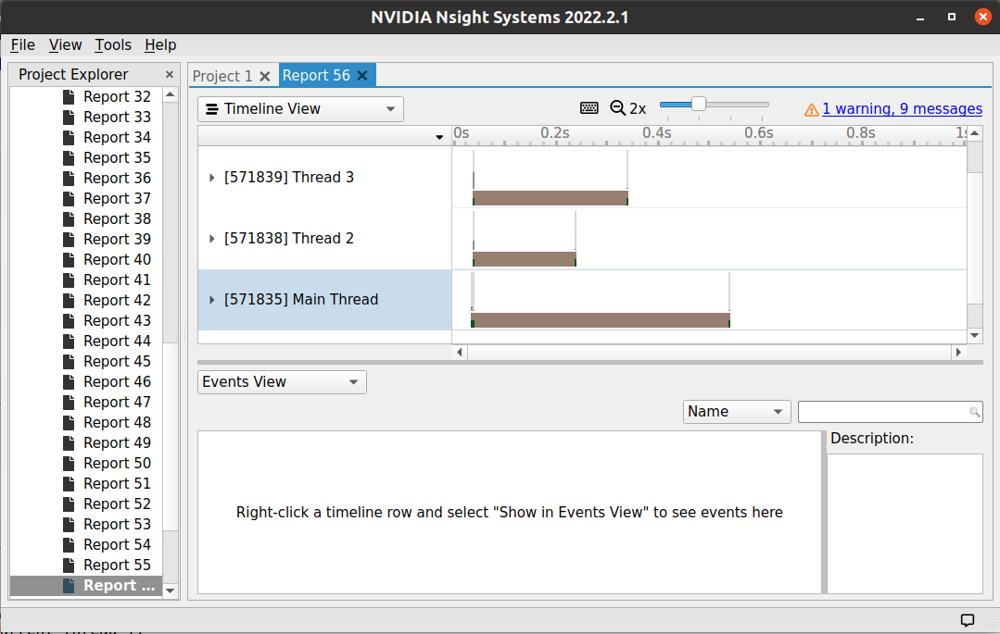

# Naming threads

Thread name annotations are used to narrow optics on specific metrics for threads.

They are visible in the events of the NVTX trace in programs such as NVIDIA NSight Systems.

# Running the example (NVIDIA NSight Systems)

 1. Open NVIDIA NSight Systems
 2. Start a new project
 3. Select a target host for profiling (local computer is fine)
 4. Set the target application information to:
    * Command line with arguments: `cargo run --example naming_threads`
    * Set the working directory to the nvtx directory path
 5. Collect NVTX trace, CPU context, and OS runtime libraries
 6. Start the project (wait for completion)
 7. Open the report
 8. Right click the NVTX trace layer and "Show in Events View"
